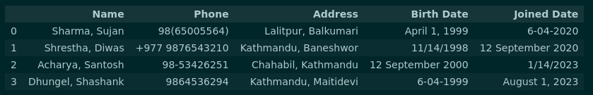
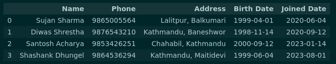

# Data wrangling

Data wrangling is known as data mngling and data cleaning. In general it refers to the process of collecting, sorting, transforming and organizing the raw data into usuable and **understandable format**.
The quality of data, structure of data and the consiistency within the data is improved and thus helps in clear decision making, performing exploratory analysis, revealing insights and patterns that might be hidden in raw data.

Threr are various of sources for data and the row data collected through those sources can be messy, incomplete, non uniform and present in wrong format as well.

Technology has eveolved this much with artificial intelligence and machine learning but still some of the task with in data wrangling is done manually or at least it required the humann guides.  
_Data munging requires advanced knowledge of the raw data, what kinds of analyses it will be run through, and what information needs to be removed_.

Data wrangling is generally applied to individual “data types” within a data set: rows, columns, values, fields, etc. Data munging and wrangling examples include:

- Removing data that is irrelevant to the analysis. In text analysis this could be stop words (the, and, a, etc.), URLs, symbols and emojis, etc.
- Removing gaps in data, like empty cells in a spreadsheet or blank spaces between words in a document.
- Combining data from multiple sources and multiple sets into a single data set.
- Data parsing: for example, turning HTML into a more standardized/easily analyzable format.
- Data augmentation to create more robust machine learning models: for example, synonym replacement and random word deletion.
- Filtering data according to locations, demographics, periods of time, etc.

### Why we need Data wrangling

As you increase the amount of raw data you’re using, you’ll also increase the amount of inherently “bad” or unnecessary data within these data sets. However, when you set up a proper data wrangling process, you’ll be able to clean this data more rapidly as you progress through it, because you’ll have the systems in place to handle it all.
Cleaned and transformed data provides a solid foundation for meaningful analysis, preventing skewed or inaccurate conclusions.  
Addressing missing data through wrangling prevents biased insights and inaccurate model training, leading to more robust results.  
**Better data is even more important than having the most powerful algorithms**, and that data wrangling is actually the most important step in data analysis.

## Data Wrangling Process

Here are the six essential steps involved in the data wrangling process. Data wrangling is a crucial stage that prepares raw data for analysis and modeling.

### 1. Data Gathering

Collect data from various sources, including databases, APIs, files, or other relevant sources. Ensure to obtain all necessary data for the analysis.

### 2. Data Structuring and inspection

Thoroughly examine the dataset to understand its structure, variables, and any apparent issues such as missing values, outliers, and inconsistencies.  
Data structuring is the process of formatting your data, so that it’s uniform and will be ready for analysis.
This step provides insights into the quality of the raw data.

### 3. Data Cleaning

- **Handling Missing Values:** Decide on strategies to handle missing data, either by imputing values or removing instances with missing data.
- **Dealing with Outliers:** Identify and address outliers that could skew analysis or modeling results. Use appropriate methods to manage extreme values.

### 4. Data Transformation

- **Feature Engineering:** Create new features or derive additional variables that provide more relevant information for analysis or modeling.
- **Data Format Conversion:** Convert data types to ensure consistency and compatibility among variables.
- **Encoding Categorical Variables:** Convert categorical variables into numerical representations (e.g., one-hot encoding).

### 5. Data Integration

Sometimes after all above operation on the data, you may realize that you have much less usable data than you initially thought.
The general rule with machine learning is that more data is better. But it will all depend on the project at hand.  
You may enrich the amount of data available at the moment.

- **Combining Data:** Merge data from different sources into a single dataset, ensuring that data aligns properly. Consider using common identifiers for accurate merging.
- **Joining Data:** Combine related datasets using common identifiers to enrich the data with additional information.

### 6. Data Validation and Documentation

- **Data Integrity Check:** Validate the processed data to ensure that it remains accurate and consistent after transformations. Perform cross-checks and validations as necessary.
- **Documentation:** Keep track of changes made during the wrangling process. Document variable definitions, transformations, and other modifications for future reference.

This structured approach to data wrangling ensures that the data is prepared effectively for analysis, leading to more accurate and reliable results.

## Data Wrangling tools and techniques

Traditionally, data wrangling was primarily performed manually using spreadsheet software such as Excel and Google Sheets. This approach works well for small datasets that don't need extensive cleaning and enhancement. However, when dealing with larger volumes of data, it's more advisable to utilize advanced technologies for more efficient processing.

This document categorizes data wrangling tools based on whether they require coding or offer a code-free approach. Choose a tool that best suits your data wrangling needs and technical expertise.

### Tools Requiring Coding:

1. **Python with pandas:**
   The pandas library in Python provides powerful tools for data manipulation and analysis.It is suitable for handling structured data and performing extensive data wrangling tasks.It requires familiarity with Python programming.

2. **R with dplyr and tidyr:**
   R is a programming language designed for data analysis. The dplyr and tidyr packages offer functions for data manipulation and reshaping.It is effective for data manipulation and transformation tasks.It requires familiarity with R programming.

3. **Apache Spark:**
   Apache Spark is a distributed computing framework with Spark SQL and Spark DataFrame libraries for large-scale data processing.It is suitable for handling substantial volumes of data and complex data wrangling tasks. It is recommended for those who comfortable with distributed computing concepts.

### Tools Not Requiring Coding:

1. **Microsoft Excel** / **Google Sheets:**
   Excel / Google sheets are widely used spreadsheet application offering basic data cleaning and transformation capabilities. Both are ideal for small to medium-sized datasets and simple data manipulation tasks. Google sheets enables collaboration.

2. **OpenRefine:** OpenRefine (formerly Google Refine) is an open-source tool for cleaning and transforming messy data.It is helpful for larger datasets with issues like missing values, outliers, and inconsistencies.

3. **Trifacta:** Trifacta Wrangler is a data preparation platform with a visual interface for exploring, cleaning, and transforming data. It is suitable for users with varying technical expertise; offers a visual approach to data wrangling.

4. **Alteryx:** Alteryx is a comprehensive data preparation and analytics platform with a visual interface for blending, cleansing, and transformation.It is suitable for complex data wrangling tasks and integration with various data sources.

5. **KNIME:** KNIME is an open-source platform for data analytics and automation with a visual workflow interface.It is effective for building data preparation pipelines, integrating data, and performing transformations.

There are many other tools available but above mentioned are the common one.  
Choose the appropriate data wrangling tool based on your data volume, complexity, technical proficiency, and desired level of automation. Each tool offers unique features to streamline your data preparation process.

Here’s a basic example of what data wrangling looks like in practice using Python (Pandas) on small dataset. All the data points have been standardized, making the data easier to analyze:

Starting Collected Data

Result after **Data wrangling**

